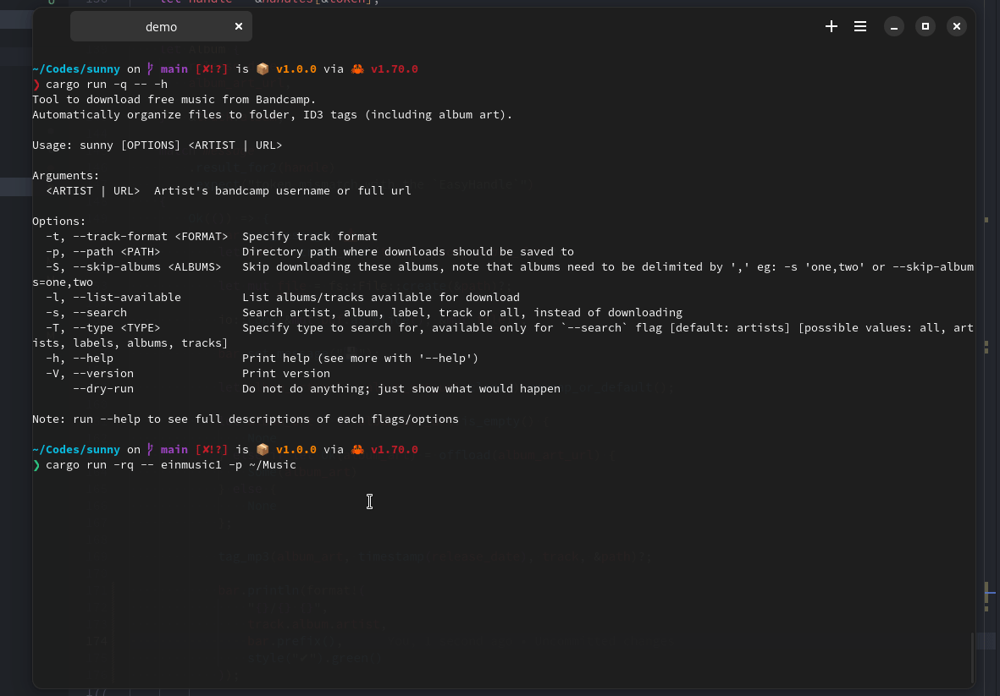

<h1 align="center">Welcome to sunny 🌞</h1>
<p align="center">
  <a href="https://crates.io/crates/sunny" target="_blank">
    
  </a>
  <a href="https://docs.rs/sunny" target="_blank">
    
  </a>
  
</p>

> Tool to download freely available music from bandcamp.
>
> Automatically organize files to folder, ID3 tags (including album art).

### Demo

[](./assets/demo.gif)

### Motivation

Sunny is hugely inspired by [SoundScrape](https://github.com/Miserlou/SoundScrape), the main motivation for writing this was speed and customizability.

- SoundScrape downloads sequentially whereas Sunny does parallelly, giving a huge boost of speed.
- Track format can be customized.

### Format

By default, files are saved in this structure in current directory if `--path` option is not passed.

```
Artist
  ├── Album
  │   ├── 01 - Track.mp3
  │   ├── 02 - Track.mp3
  │   ├── 03 - Track.mp3
  │   ├── 04 - Track.mp3
```

## Install

```sh
cargo install sunny
```

## Usage

```sh
# whole discography of an artist by url
sunny https://65daysofstatic.bandcamp.com/music

# whole discography just by the name of the artist
sunny 65daysofstatic

# single album
sunny https://clevergirl.bandcamp.com/album/no-drum-and-bass-in-the-jazz-room

# single track
sunny https://65daysofstatic.bandcamp.com/track/twenty-four-twelve-twenty

# specify path to download to
sunny yvetteyoung --path=~/Music
```

## CLI options

```
Usage: sunny [OPTIONS] <ARTIST | URL>

Arguments:
  <ARTIST | URL>
          Artist's bandcamp username or full url

Options:
  -t, --track-format <FORMAT>
          Specify track format: default is '{num} - {track}'

          available keys:
              {num} - track number
              {track} - track
              {artist} - artist
              {album} - album

          usage:
              -t='{num} - {track} - {album} {artist}'

          expands to:
              2 - Track - Album Artist

          note that `.mp3` is appended automatically.

  -p, --path <PATH>
          Directory path where downloads should be saved to.
          By default files are saved in the current directory.

  -S, --skip-albums <ALBUMS>
          Skip downloading these albums, note that albums need to be delimited by ',' eg: -S 'one,two' or --skip-albums=one,two

  -l, --list-available
          List albums/tracks available for download

  -s, --search
          Search artist, album, label, track or all, instead of downloading

  -T, --type <TYPE>
          Specify type to search for, available only for `--search` flag

          [default: artists]
          [possible values: all, artists, labels, albums, tracks]

  -h, --help
          Print help (see a summary with '-h')

  -V, --version
          Print version

      --dry-run
          Do not do anything; just show what would happen

Note: run --help to see full descriptions of each flags/options
```

## Contributing

Contributions, issues and feature requests are welcome!

Please have a look at [TODO.md](./TODO.md). 